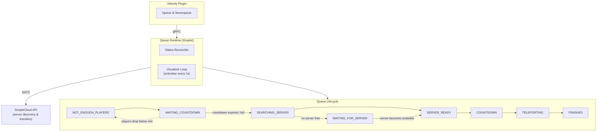

# Queue

A [SimpleCloud](https://simplecloud.app) droplet for queuing players into minigames with automatic server provisioning and player transfers.

## Architecture

```
queue/
├── queue-api        # Java client library (gRPC + NATS) for interacting with the queue
├── queue-plugin     # Velocity proxy plugin providing /queue and /leavequeue commands
├── queue-runtime    # Standalone runtime (the droplet) managing the queue lifecycle
└── queue-shared     # Shared utilities
```

## Architecture Diagram


### How it works

The runtime manages queues through a **status reconciler** that drives each queue through its lifecycle:

```
NOT_ENOUGH_PLAYERS → WAITING_COUNTDOWN → SEARCHING_SERVER → WAITING_FOR_SERVER/SERVER_READY → COUNTDOWN → TELEPORTING → FINISHED
```

1. **NOT_ENOUGH_PLAYERS** — Waiting for the minimum player count to be reached
2. **WAITING_COUNTDOWN** — Minimum reached, countdown running while waiting for more players (or until full)
3. **SEARCHING_SERVER** — Countdown expired or queue full, reserving an available server
4. **WAITING_FOR_SERVER** — No server available yet, waiting for one to become ready
5. **SERVER_READY** — Server reserved, starting the game countdown
6. **COUNTDOWN** — Final countdown before teleporting players
7. **TELEPORTING** — Transferring all players to the game server
8. **FINISHED** — Cleanup: free the server, delete the queue

The reconciler uses **delta-time countdown tracking** and **per-queue mutex synchronization** to ensure thread-safe status transitions. A dedicated **visualizer loop** sends actionbar messages to all players in active queues every second.

### Communication

- **gRPC** — Client-server communication for enqueue/dequeue operations
- **NATS** — Messaging with failover connection management
- **SimpleCloud API** — Server discovery, player transfers, and event subscriptions

## Queue Type Configuration

Queue types are defined as YAML files in the config directory:

```yml
name: dev
group: dev
max-capacity: 2
min-capacity: 1
waiting-countdown-seconds: 30
countdown-seconds: 10
```

| Field | Description |
|---|---|
| `name` | Unique identifier for this queue type |
| `group` | SimpleCloud server group to use for game servers |
| `min-capacity` | Minimum players required to start the waiting countdown |
| `max-capacity` | Maximum players per queue (starts immediately when full) |
| `waiting-countdown-seconds` | Seconds to wait for more players after minimum is reached |
| `countdown-seconds` | Seconds to count down before teleporting after server is ready |

## API Usage

### Dependency

```kotlin
// build.gradle.kts
repositories {
    maven("https://repo.xxjanisxx.dev/releases")
}

dependencies {
    implementation("net.mythicisland.queue:queue-api:0.0.1-beta.1")
}
```

### Connecting

```kotlin
val api = QueueApi.create(
    QueueApiOptions.builder()
        .grpcHost("localhost")
        .grpcPort(4564)
        .natsUrl("nats://localhost:4222")
        .natsUser("your-user")
        .natsSecret("your-secret")
        .build()
)
```

### Enqueue a player

```kotlin
val playerId = player.uniqueId

// Single player
api.player().enqueue("dev", playerId).await()

// Multiple players (party queue)
api.player().enqueue("dev", listOf(player1Id, player2Id)).await()
```

### Dequeue a player

```kotlin
api.player().dequeue(playerId).await()
```

### Error handling with coroutines

```kotlin
try {
    api.player().enqueue("dev", playerId).await()
    player.sendMessage("You have been added to the queue.")
} catch (e: StatusRuntimeException) {
    // gRPC errors: NOT_FOUND (unknown queue type), FAILED_PRECONDITION (already queued), etc.
    player.sendMessage(e.status.description ?: "Failed to join queue.")
}
```

### Data API

```kotlin
// Get all available queue types (e.g. for tab completion or selection GUI)
val types = api.data().getAllQueueTypes().await()
types.queueTypesList.forEach { println(it.name) }

// Check which queue a player is in
val response = api.data().getQueueByPlayer(playerId).await()
val queue = response.queue
println("Player is in queue ${queue.type} (${queue.status})")

// Get player's position in their queue
val position = api.data().getPlayerPosition(playerId).await()
println("Position: ${position.position}/${position.queue.playerIdsCount}")

// Get all active queues of a specific type
val queues = api.data().getQueuesByType("dev").await()
println("${queues.queuesCount} active dev queues")

// Get a specific queue type's configuration
val type = api.data().getQueueType("dev").await()
println("${type.queueType.name}: ${type.queueType.minCapacity}-${type.queueType.maxCapacity} players")

// Get a specific queue by ID
val queue = api.data().getQueue(queueId).await()
```

### Cleanup

```kotlin
api.close()
```

## Development

### Prerequisites

- JDK 21+
- A running SimpleCloud network
- NATS server

### Building

```bash
./gradlew build
```

### Running the runtime

The runtime is configured via CLI options, environment variables, or a `queue.properties` file:

```bash
./gradlew :queue-runtime:run --args="--grpc-port=4564 --nats-url=nats://localhost:4222 --network-id=your-id --network-secret=your-secret --controller-url=https://controller.platform.simplecloud.app"
```

| Option | Env Variable | Default | Description |
|---|---|---|---|
| `--grpc-port` | `GRPC_PORT` | `4564` | gRPC server port |
| `--nats-url` | `NATS_URL` | — | NATS connection URL |
| `--nats-user` | `NATS_USER` | — | NATS username |
| `--nats-secret` | `NATS_SECRET` | — | NATS password |
| `--nats-failover-reconnect-after` | `NATS_FAILOVER_RECONNECT_AFTER` | `30s` | Full reconnect timeout (e.g. `30s`, `2m`) |
| `--config-path` | `CONFIG_PATH` | `.` | Path to config directory |
| `--network-id` | `NETWORK_ID` | — | SimpleCloud network ID |
| `--network-secret` | `NETWORK_SECRET` | — | SimpleCloud network secret |
| `--controller-url` | `CONTROLLER_URL` | `https://controller.platform.simplecloud.app` | SimpleCloud controller URL |
| `--controller-nats-url` | `CONTROLLER_NATS_URL` | `nats://platform.simplecloud.app:4222` | SimpleCloud controller NATS URL |

### Running the Velocity plugin

```bash
./gradlew :queue-plugin:runVelocity
```

### Publishing the API

```bash
./gradlew :queue-api:publish
```

## Player Commands

| Command | Permission | Description |
|---|---|---|
| `/queue <type>` | `mythicisland.queue.command.enqueue` | Join a queue of the specified type |
| `/leavequeue` | `mythicisland.queue.command.dequeue` | Leave your current queue |
