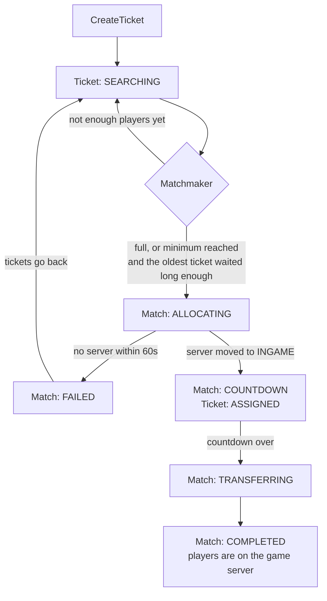

# Queue v2

A microservice that queue players into minigames and moves them to a game server.

## Concepts

| Concept        | What it is                                                                 |
|----------------|----------------------------------------------------------------------------|
| **Ticket**     | A player or a whole party that wants to play.                              |
| **Match**      | A set of tickets that will play together on one server.                    |
| **Assignment** | The server a match was given.                                              |
| **Queue type** | The configuration: which server group, how many players, how long to wait. |

Splitting the intent (ticket) from the result (match) is what makes the rest work. A ticket
can wait in several queue types at once, and matches can form independently of who asked
for what.

## How a match comes together



1. **Searching**: the ticket sits in the pool of every queue type it asked for.
2. **Matchmaking**: a match is formed as soon as the queue type is full
3. **Allocating**: a free server of the group is moved to `INGAME`, which i.s what keeps the next match from taking it too.
4. **Countdown**: the ticket learns its server and when it will be moved, so a client can render the countdown itself instead of polling.
5. **Transferring**: every player is connected, then the match is done and its tickets are removed.

## Multi-Queue

A ticket can search in several queue types at the same time and joins whichever match fills
up first:

```kotlin
api.ticket().create {
    party(members)
    queues("battle", "skywars")
}
```

## Modules

| Module          | What is in it                                                              |
|-----------------|----------------------------------------------------------------------------|
| `queue-runtime` | The service: ticket store, matchmaker, match reconciler, server allocator. |
| `queue-api`     | Java and Kotlin client, talks gRPC and listens to the NATS events.         |
| `queue-shared`  | Common shared files for the runtime and API.                               |
| `proto`         | The protobuf definitions, published to the Buf Schema Registry.            |

## Configuration

Queue types are YAML files in the types directory, one per queue:

```yaml
# types/battle.yml
name: battle
group: battle
min-players: 8
max-players: 16
waiting-duration-seconds: 30
countdown-duration-seconds: 10
```

Everything else comes from environment variables or a `queue.properties`

| Variable                | Default                              |
|-------------------------|--------------------------------------|
| `GRPC_PORT`             | `4564`                               |
| `NATS_URL`              | `nats://localhost:4222`              |
| `TYPE_PATH`             | `types`                              |
| `AUTH_KEY_PATH`         | `.secrets/auth.key`                  |
| `CONTROLLER_URL`        | `https://controller.simplecloud.app` |
| `CONTROLLER_NATS_URL`   | `wss://nats.simplecloud.app:443`     |

## TODO

- [x] **Multi Queue**: Let a player search in several queue types at once
- [ ] **Ticket TTL**: Drop tickets whose players went offline without leaving the queue
- [ ] **Metrics**: Time to match, fill rate, allocation latency, failed matches
- [ ] **Estimated wait**: Show players how long they will probably wait
- [ ] **Drain mode**: Finish the running matches before shutting down
- [ ] **Queue Rating**: Rate queues by how alive they are
