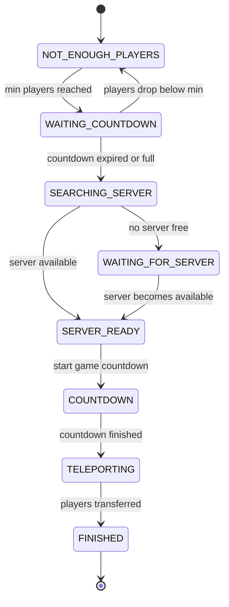

# Queue

A [SimpleCloud](https://simplecloud.app) droplet for queuing players into minigames with automatic server provisioning and player transfers.

## Architecture

### Queue Lifecycle



| Status | Description |
|---|---|
| `NOT_ENOUGH_PLAYERS` | Waiting for the minimum player count |
| `WAITING_COUNTDOWN` | Minimum reached, counting down while waiting for more players |
| `SEARCHING_SERVER` | Reserving an available game server |
| `WAITING_FOR_SERVER` | No server available yet, waiting for one |
| `SERVER_READY` | Server reserved, starting the game countdown |
| `COUNTDOWN` | Final countdown before teleport |
| `TELEPORTING` | Transferring players to the game server |
| `FINISHED` | Cleanup: free server, delete queue |

### How it works

The runtime manages queues through a **status reconciler** that drives each queue through its lifecycle. It uses **delta-time countdown tracking** and **per-queue mutex synchronization** for thread-safe transitions. A **visualizer loop** sends actionbar messages to all queued players every second.

Queues are persisted to a PostgreSQL database so they survive runtime restarts. On startup, queues are restored from the database and server-dependent states are reset to `SEARCHING_SERVER`.

### Communication

| Protocol | Purpose |
|---|---|
| gRPC | Client-server communication (enqueue, dequeue, queries) |
| NATS | Event publishing with failover connection management |
| PostgreSQL | Queue persistence across restarts |

## Queue Type Configuration

Queue types are defined as YAML files in the config directory:

```yml
name: dev
group: dev
max-capacity: 2
min-capacity: 1
waiting-countdown-seconds: 30
countdown-seconds: 10
```

| Field | Description |
|---|---|
| `name` | Unique identifier for this queue type |
| `group` | SimpleCloud server group to use for game servers |
| `min-capacity` | Minimum players required to start the waiting countdown |
| `max-capacity` | Maximum players per queue (starts immediately when full) |
| `waiting-countdown-seconds` | Seconds to wait for more players after minimum is reached |
| `countdown-seconds` | Seconds to count down before teleporting after server is ready |

## API Usage

### Dependency

```kotlin
// build.gradle.kts
repositories {
    maven("https://repo.xxjanisxx.dev/releases")
}

dependencies {
    implementation("net.mythicisland.queue:queue-api:0.0.1-beta.1")
}
```

### Connecting

```kotlin
val api = QueueApi.create(
    QueueApiOptions.builder()
        .grpcHost("localhost")
        .grpcPort(4564)
        .natsUrl("nats://localhost:4222")
        .natsUser("your-user")
        .natsSecret("your-secret")
        .build()
)
```

### Enqueue a player

```kotlin
val playerId = player.uniqueId

// Single player
api.player().enqueue("dev", playerId).await()

// Multiple players (party queue)
api.player().enqueue("dev", listOf(player1Id, player2Id)).await()
```

### Dequeue a player

```kotlin
api.player().dequeue(playerId).await()
```

### Error handling with coroutines

```kotlin
try {
    api.player().enqueue("dev", playerId).await()
    player.sendMessage("You have been added to the queue.")
} catch (e: StatusRuntimeException) {
    // gRPC errors: NOT_FOUND (unknown queue type), FAILED_PRECONDITION (already queued), etc.
    player.sendMessage(e.status.description ?: "Failed to join queue.")
}
```

### Data API

```kotlin
// Get all available queue types (e.g. for tab completion or selection GUI)
val types = api.data().getAllQueueTypes().await()
types.queueTypesList.forEach { println(it.name) }

// Check which queue a player is in
val response = api.data().getQueueByPlayer(playerId).await()
val queue = response.queue
println("Player is in queue ${queue.type} (${queue.status})")

// Get player's position in their queue
val position = api.data().getPlayerPosition(playerId).await()
println("Position: ${position.position}/${position.queue.playerIdsCount}")

// Get all active queues of a specific type
val queues = api.data().getQueuesByType("dev").await()
println("${queues.queuesCount} active dev queues")

// Get a specific queue type's configuration
val type = api.data().getQueueType("dev").await()
println("${type.queueType.name}: ${type.queueType.minCapacity}-${type.queueType.maxCapacity} players")

// Get a specific queue by ID
val queue = api.data().getQueue(queueId).await()
```

### Event API

Listen to real-time queue lifecycle events via NATS:

```kotlin
// Player events
api.event().player().onEnqueued { event ->
    println("${event.playerIds()} joined queue ${event.queueType()} (${event.queueId()})")
}

api.event().player().onDequeued { event ->
    println("${event.playerIds()} left queue ${event.queueType()}")
}

// Queue lifecycle events
api.event().queue().onCreated { event ->
    println("New queue created: ${event.queueId()} (type: ${event.queueType()})")
}

api.event().queue().onStatusUpdated { event ->
    println("Queue ${event.queueId()}: ${event.oldStatus()} -> ${event.newStatus()}")
}

api.event().queue().onServerAssigned { event ->
    println("Queue ${event.queueId()} assigned to server ${event.serverId()}")
}

api.event().queue().onTransfer { event ->
    println("${event.transferredPlayerIds().size} players transferred to ${event.serverId()}")
}

api.event().queue().onDeleted { event ->
    println("Queue ${event.queueId()} deleted")
}

// General queue change listener (fires on any state change)
api.event().queue().onUpdated { event ->
    println("Queue ${event.queueId()}: ${event.beforeStatus()} -> ${event.afterStatus()}")
}
```

Subscriptions can be cancelled:

```kotlin
val subscription = api.event().queue().onStatusUpdated { event ->
    // ...
}

// Later, when no longer needed
subscription.unsubscribe()
```

### Cleanup

```kotlin
api.close()
```

## Development

### Prerequisites

- JDK 21+
- A running SimpleCloud network
- NATS server

### Building

```bash
./gradlew build
```

### Running the runtime

The runtime is configured via CLI options, environment variables, or a `queue.properties` file:

```bash
./gradlew :queue-runtime:run"
```

### Running the Velocity plugin

```bash
./gradlew :queue-plugin:runVelocity
```

### Publishing the API

```bash
./gradlew :queue-api:publish
```