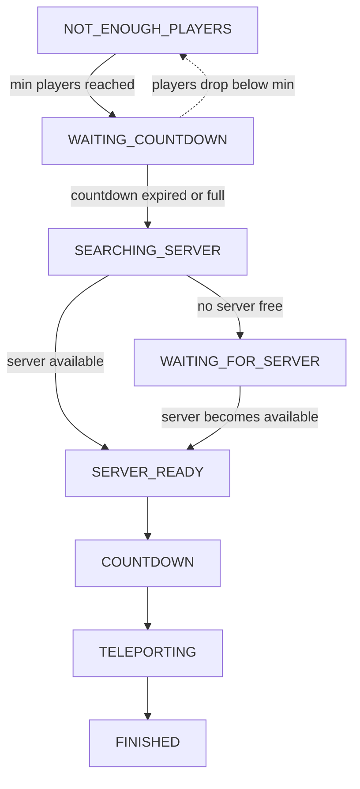

# Queue

A [SimpleCloud](https://simplecloud.app) droplet for queuing players into minigames with automatic server provisioning and player transfers.

## Architecture

### Queue Lifecycle



| Status               | Description                                                   |
|----------------------|---------------------------------------------------------------|
| `NOT_ENOUGH_PLAYERS` | Waiting for the minimum player count                          |
| `WAITING_COUNTDOWN`  | Minimum reached, counting down while waiting for more players |
| `SEARCHING_SERVER`   | Reserving an available game server                            |
| `WAITING_FOR_SERVER` | No server available yet, waiting for one                      |
| `SERVER_READY`       | Server reserved, starting the game countdown                  |
| `COUNTDOWN`          | Final countdown before teleport                               |
| `TELEPORTING`        | Transferring players to the game server                       |
| `FINISHED`           | Cleanup: free server, delete queue                            |

### How it works

The runtime manages queues through a **reconciler** that drives each queue through its lifecycle. It uses **delta-time countdown tracking** and **per-queue mutex synchronization** for thread-safe transitions. A **visualizer loop** sends actionbar messages to all queued players every second.

Queues are saved to a PostgreSQL database so they survive runtime restarts. On startup, queues are restored from the database and server-dependent states are reset to `SEARCHING_SERVER`.

### Communication

| Protocol   | Purpose                                                 |
|------------|---------------------------------------------------------|
| gRPC       | Client-server communication (enqueue, dequeue, queries) |
| NATS       | Event publishing with failover connection management    |
| PostgreSQL | Queue persistence across restarts                       |

## Queue Type Configuration

Queue types are defined as YAML files in the config directory:

```yml
name: minekart
group: minekart
max-capacity: 6
min-capacity: 12
waiting-countdown-seconds: 30
countdown-seconds: 10
```

| Field                       | Description                                                    |
|-----------------------------|----------------------------------------------------------------|
| `name`                      | Unique identifier for this queue type                          |
| `group`                     | SimpleCloud server group to use for game servers               |
| `min-capacity`              | Minimum players required to start the waiting countdown        |
| `max-capacity`              | Maximum players per queue (starts immediately when full)       |
| `waiting-countdown-seconds` | Seconds to wait for more players after minimum is reached      |
| `countdown-seconds`         | Seconds to count down before teleporting after server is ready |

## Development

### Prerequisites

- JDK 21+
- A running SimpleCloud network
- NATS server

### Building

```bash
./gradlew build
```